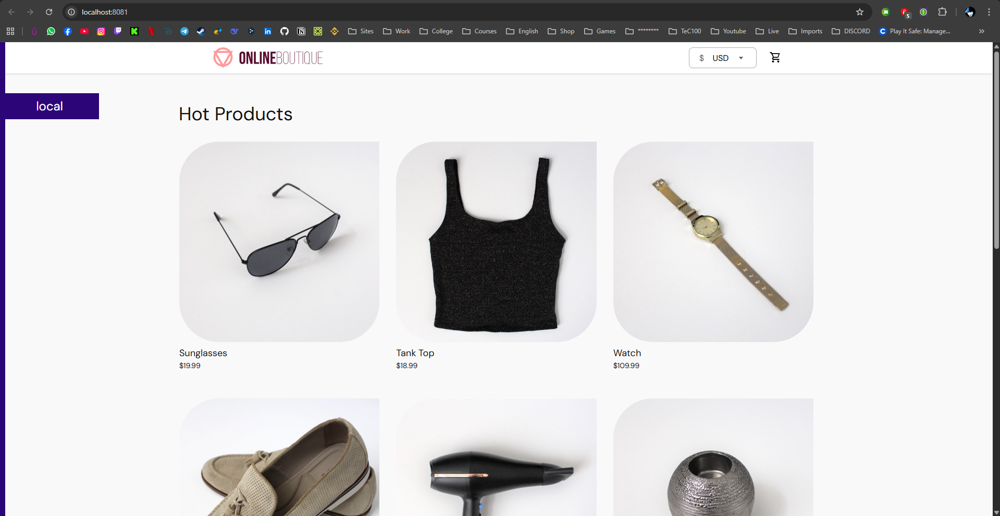

# Projeto GitOps - Compass UOL | DevSecOps (Windows 11)

## 📝 Descrição do Projeto

Projeto prático de GitOps na trilha de Kubernetes | DevSecOps.

Esse README guia **passo a passo** para configurar um ambiente Windows
11, criar um repositório com os manifests do *Online Boutique*, instalar
**Rancher Desktop + Kubernetes**, **ArgoCD** e fazer o deploy via
GitOps. Tudo em português, com comandos prontos para copiar/colar no
PowerShell ou no WSL.

---

## 🛠️ Tecnologias Utilizadas

- Minikube
- Hyper-V
- Docker
- Kubernetes
- ArgoCD
- GitHub
- Git
- PowerShell
- Windows

---

## Pré-requisitos

- Windows 10/11 com Hyper-V habilitado
- Minikube instalado e configurado
- Git instalado e configurado localmente
- Conta no GitHub com repositório público
- PowerShell para execução dos comandos
- Kubectl instalado e configurado

---

## Índice

-   [Pré-requisitos](#pré-requisitos)
-   [Etapa 0 - Preparar Windows (WSL2)](#etapa-0--preparar-windows-(wsl2))
-   [Etapa 1 - Instalar Rancher Desktop](#etapa-1--instalar-rancher-desktop)
-   [Etapa 2 - Instalar kubectl e Git](#etapa-2--instalar-kubectl-e-git)
-   [Etapa 3 - Fork e criar repositório GitHub](#etapa-3--fork-e-criar-repositório-gitHub)
-   [Etapa 4 - Instalar ArgoCD](#etapa-4--instalar-argocd)
-   [Etapa 5 - Acessar ArgoCD](#etapa-5--acessar-argoCD)
-   [Etapa 6 - Criar App no ArgoCD](#etapa-6--criar-app-no-argocd)
-   [Etapa 7 - Acessar frontend](#etapa-7--acessar-frontend)
-   [Resultado Final](#resultado-final)
-   [Entregáveis](#entregáveis)

## Pré-requisitos

-   Windows 11
-   GitHub
-   Internet
-   (Opcional) WSL2 ativado

## Etapa 0 - Preparar Windows (WSL2)

``` powershell
wsl --install
```

## Etapa 1 - Instalar Rancher Desktop

Baixe em https://rancherdesktop.io/ e ative **Kubernetes**.

Verifique:

``` bash
kubectl get nodes
```

## Etapa 2 - Instalar kubectl e Git

``` powershell
curl -LO "https://dl.k8s.io/release/stable.txt"
# mover kubectl.exe para PATH
```
Instalar Git: https://git-scm.com/download/win

## Etapa 3 - Fork e repositório GitHub

``` bash
git clone https://github.com/<seu-usuario>/gitops-microservices.git
cd gitops-microservices
mkdir -p k8s
curl -L "https://raw.githubusercontent.com/GoogleCloudPlatform/microservices-demo/main/release/kubernetes-manifests.yaml" -o k8s/online-boutique.yaml
git add .
git commit -m "Adicionar manifests"
git push origin main
```

## Etapa 4 - Instalar ArgoCD

``` bash
kubectl create namespace argocd
kubectl apply -n argocd -f https://raw.githubusercontent.com/argoproj/argo-cd/stable/manifests/install.yaml
```

## Etapa 5 - Acessar ArgoCD

``` bash
kubectl port-forward svc/argocd-server -n argocd 8080:443
```

Acesse https://localhost:8080

Senha:

``` bash
kubectl -n argocd get secret argocd-initial-admin-secret -o jsonpath="{.data.password}" | base64 -d
```

## Etapa 6 - Criar App no ArgoCD

-   NEW APP
-   Repo: `https://github.com/<seu-usuario>/gitops-microservices`
-   Path: `k8s`
-   Cluster: `https://kubernetes.default.svc`
-   Namespace: `default`
-   Após isso clicar em -> `SYNC`

## Etapa 7 - Acessar frontend (port-forward)

``` bash
kubectl get svc -A | grep frontend
kubectl port-forward svc/frontend 8081:80 -n default
```

Acesse: `http://localhost:8081`

## Resultado Final
<p align="center">
  
</p>

## Entregáveis

-   Repositório Git público com manifest
-   ArgoCD instalado (`kubectl get pods -n argocd`)
-   App sincronizado
-   Frontend acessível via port-forward
